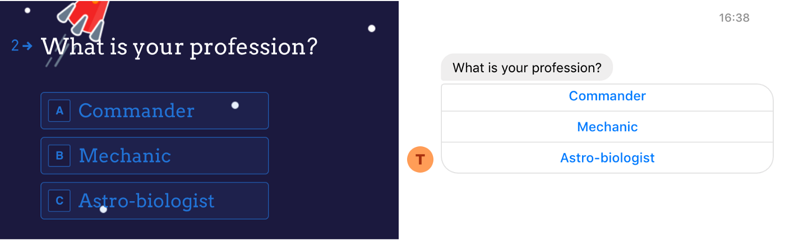
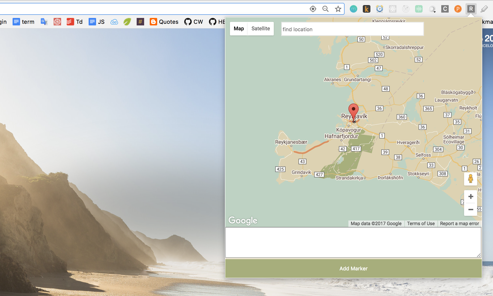
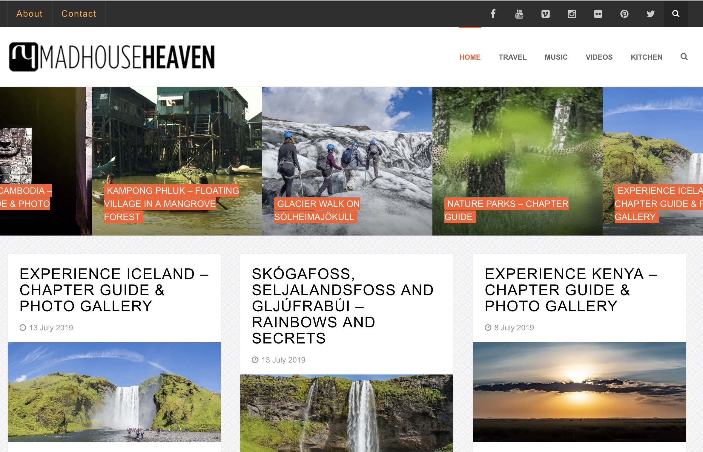

# Hi! I'm Isabella.

I'm a Full Stack Software Engineer, and I work with **JavaScript**. I've been developing apps and websites for three years, and I've worked on many projects with a wide variety of technologies. Most of my earliest projects are NodeJS projects, with MongoDB. I've also developed a couple of Facebook apps, and even a library to [convert a Typeform into a conversation on Facebook Messenger](https://medium.com/typeforms-engineering-blog/making-bots-with-typeform-12212d5740f8).

I'm interested in working in a fast paced environment with a tech stack I want to work with, and plenty of interesting challenges.

I've developed many **production ready apps** in a wide variety of technologies.

---

# My Tech Stack

- Express/Koa
- Mongoose + MongoDB
- Firebase
- Strapi (A NodeJS headless CMS)
- React + Redux
- Vue + Typescript
- GatsbyJS

---

# Experience

### Plain Concepts

_Sept 2018 - present_ \
Software Engineer working in a Full Stack role on a wide variety of consultancy projects. I've worked on marketing websites, pixel perfect Microsoft demos, enterprise tools, and even a hinting engine for web best practices.

### Codeworks

_January 2018 - September 2018_ \
Software Engineer and JavaScript Teaching Assistant. I developed internal tools used in the evaluation of student performance and the handing out of assignments and notes. I worked with Express, Firebase and Heroku. Earlier iterations of the project were in mySQL.

### The World Banke

_April 2018 - June 2018_
Consultancy work for the World Bank working on a proof of concept for data collection through Facebook Messenger. The idea was to use Typeform's form system to make it easy for workers in developing countries to create their own chatbot on Facebook. NodeJS was used as middle-end architecture between the forms and Facebook's API.

### She Says Singapore

_July 2018 - August 2018_
Website developer for She Says Singapore with React/Gatsby, GraphQL and Styled Components. This project led to working on a node plugin to pull data from Eventful and transform them so Gatsby's GraphQL architecture could consume it.

---

# Projects

## [Webhint.io](https://webhint.io/)

> ##### NodeJS CLI + Typescript

Webhint is a linting tool that's meant to help website owners and developers with their site's accessibility, speed, security and more. On this project, I worked on an algorithm to check if a website was using unsupported CSS. Unit testing with Ava.

## Typeform to Facebook Messenger

> ##### NodeJS + Typeform API + Facebook Messenger API

A proof of concept for the World Bank to use Typeform and Facebook Messenger to give non-developers the power to create their own bots. The project was a NodeJS server that served as a middle-end between Typeform's API and Facebook's API. Unit testing with Jest.

## In&Out

> ##### NodeJS + Vue + Typescript

A marketing website that provides recommendations for what to see, do and eat in Barcelona. I worked on the interactive map - responsive styling, the service on the front end and the controllers in the back end.

## Map Stories

> ##### NodeJS + MongoDB + Mocha/Chai

A web app for location based storytelling using maps. Users can sign up to the app and create they own stories with images, text and video. I worked on the backend with Koa and MongoDB. Unit and integration testing with Mocha, Chai and Sinon.

## Map Marklet

> ##### React/Redux + Chrome Extensions API + NodeJS

A Chrome extension that lets users save urls to markers on a personal instance of Google Maps. While planning for road trips, I often save bookmarks to many websites which I then reference later. However, it's difficult to know the locations the websites refer to. This Chrome extension helps users locate the places that the websites refer to on a map.

## Madhouse Heaven

> Wordpress + PHP

This is my travel website which I've had for quite some years now. Occasionally I go in and tweak the template and some of the plugins.

